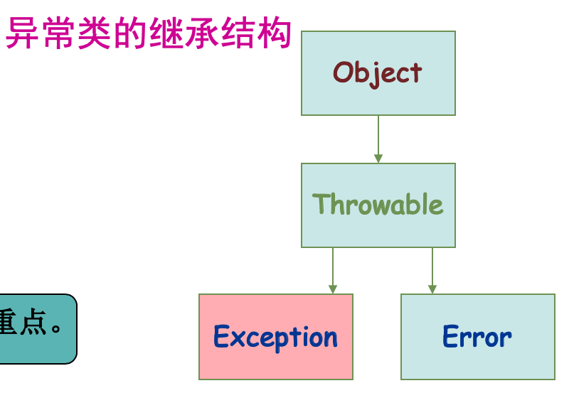

# **5. java异常处理**

---

## *5.1 异常简介*

### <1>什么是异常

- 软件开发和运行时，可能会发生下面情况
  - 想要打开的文件不存在
  - 网络连接中断
  - 操作数超出预定范围
  - 正在装载的类文件丢失
  - 访问的数据库打不开
  - ......

> [!NOTE]
> 这些并不是因为程序的错误引起的

### <2>异常处理

> ***异常*** 指程序运行过程中出现的非正常现象，例如用户输入错误、除数为零、需要处理的文件不存在、数组下标越界等

- 由于异常情况总是难免的，良好的应用程序除了具备用户所要求的功能以外，还应该具备预见并处理可能发生的各种异常的功能。这种对异常情况进行处理的技术成为*异常处理*
- 计算机系统对异常处理通常由两种方法
  - 第一种是程序直接检测程序中的错误，遇到错误给出错误信息并终止程序的运行
  - 第二种办法是由程序员在程序中加入异常处理功能

### <3>Java异常处理机制1

程序设计时必须考虑发生的突发错误，避免程序被中断或破坏，在以前的程序设计语言中，通常通过*if-else*结构来手工判断，不仅增加的程序员的工作，而且会遗漏隐藏的错误

> - Java提供了功能强大的异常处理机制，可以方便地
>   - 在程序中监视可能发生异常的程序块
>   - 并将所有异常处理代码集中放置在程序的某处

> [!NOTE]
> 使完成正常功能的程序代码与进行异常处理的程序代码分开

- Java中处理异常两种方法
  - 在发生异常的地方直接处理
  - 将异常抛给调用者，让调用者处理

### <3>Java异常处理机制2

在**Java**的异常处理机制种引进了很多用来描述和处理异常的类，成为异常类。每个异常类反映一类**运行错误**，类定义中包含了该类异常的信息和对异常进行处理的方法

- 程序执行中如出现异常，系统会检测到并自动生成一个相应的异常类对象，然后交给运行时系统
- 运行时系统自动寻找相应的异常处理代码处理这一异常。若找不到可以处理该异常的代码，则运行时系统将终止，程序运行将推出

```java
public void work() {
    try {
        工作8个小时 //可能会抛出DiseaseException异常
        下班回家
    } catch(DiseaseException e) {
        去医院看病
    }
}
```

### <3>java的异常处理机制3

- Java将异常分为*Exception（异常）*和*Error（错误）*两大类
  - **Exception类** 解决由程序本身及环境所产生的异常
  - **Error类**  JVM本身错误，不能被程序员处理
  - *Exception类异常*可以被捕获并进行处理，而对*Error类异常*，程序员通常无能为力，只能在其发生时由用户按照系统提示关闭程序



> [!IMPORTANT]
> ***Exception***是研究的重点

### <4>异常分类

- 非检查性异常：Error 和 RuntimeException 以及子类。  javac在编译时，不会提示和发现这样的异常，我们可以编写代码处理（使用try…catch…finally）这样的异常，也可以不处理。这样的异常发生的原因多半是代码写的有问题。
  - 如除0错误：ArithmeticException
  - 错误的强制类型转换错误：ClassCastException
  - 数组索引越界:ArrayIndexOutOfBoundsException
  - 使用了空对象:NullPointerException
- 检查性异常：除了Error 和 RuntimeException的其它异常。javac强制要求程序员为这样的异常做预备处理工作（使用try…catch…finally或者throws），否则编译不通过。
  - 打开不存在的文件：FileNotFoundException

---

## *5.2 异常处理*

### <1>异常处理方法

- 异常处理有两种方法
  - 使用*try...catch...finally*结构
  - 通过*throws*和*throw*抛出异常

> *try...catch...finally*一般形式

```java
try {
    可能出现异常的程序代码
} catch(异常类名1 异常对象名1) {
    异常类名1对应的异常处理代码
} catch(异常类名2 异常对象名2) {
    异常类名2对应的异常处理代码
}
    ...
    finally {  
    无论是否发生异常，一定会执行的代码
}
```

程序执行过程中，如果没有出现异常，将正常执行，*catch*块不起作用，若出现异常将终止*try*块代码的执行，自动跳转到所发生的异常类对应的代码块中，执行该块中的代码

> [!IMPORTANT]
> *Finally*块是可选项，无论是否发生异常，该块代码必定执行!!

- 语法是依据下列的顺序来处理异常
  - *try*程序块若是有异常发生时，程序的运行便中断，并抛出"异常类所产生的对象"
  - 抛出的对象如果属于*catch()*括号内欲捕获的异常类，则*catch*会捕捉此异常，然后进到*catch*的块里继续运行
  - 无论*try*程序块是否有捕捉到异常，或者捕捉到的异常是否与*catch()*括号里的异常相同，最后一定会运行*finally*块里的程序代码

> 异常例1 - 数组越界

```java
//捕获数组下界越界异常，当i<3改为i<=3时执行正常
public class ExceptionDemo01 {
    public static void main(String[] args) {
        try {
            int a[] = {1, 2, 3}, sum=0;
            for(int i = 0; i <= 3; i++)
                sum += a[i];
            System.out.println("sum=" + sum + "Successfully!");
        }
        catch (ArrayIndexOutOfBoundsException e) {
            System.out.println("ArrayIndexOutOfBoundsException detected");
            // e.printStackTrace();
            System.out.println(" 当i<=3改为i<3时执行正常!");
        }
        finally {
            System.out.println("Program Finished!");
        }
    }
}
```

> [!NOTE]
> 由于使用未定义的a[3]出现数组越界 //将i <= 3改为i < 3

> 异常例2 - 算术异常

```java
public class ExceptionDemo02{
    public static void main(String args[]) {
    //尽量不要写throws ArithmeticException 
    try {
        int x = 15, y = 0;
        System.out.println("x / y = " + x / y);
        System.out.println("Computing successfully!");
    }
    catch(ArithmeticException e) {
        System.out.println("捕获 ArithmeticException!");
        System.out.println("异常信息: "+e.toString());
    }
    finally {
        System.out.println(" 善后处理!");
    }
}
```

> [!TIP]
> 捕获 ArithmeticException！
>
>异常信息: Java.arithmeticException ：/by zero
>
>善后处理!

### <2>抛出异常

- 程序员可以在程序中通过throw语句抛出异常，其格式为：`throw new 异常类名（信息）`
  - 异常类名可以选择系统异常类名，也可以使用自定义异常类名
  - 信息项可选，若有，该信息增加在*toString()*方法的返回值中
- 如果类中定义的方法本身不捕获某种异常，将该种异常的捕获和处理交给调用它的方法，这是需要在声明本方法时，使用*throws*关键字抛出多个异常，其方法定义具体格式为：

```java
[修饰符] 返回值类型 方法名 [(参数表)] throws 异常类型名 {
    声明部分
    语句部分
}
```

- 这里指给出异常类型名，而不列追加信息
- 通常直接由Java虚拟机处理

> 异常例3 - 主动抛出异常

```java
//在自己编写的方法中主动抛出异常
//方法本身不对异常捕获和处理，而由调用它的方法去处理
class MyMath {
    public int div(int i, int j) throws Exception {   //或ArithmeticException
        return (i / j) ;
    }
}
//主类
public class ExceptionDemo03 {
    public static void main(String[] args){
        MyMath m = new MyMath();
        try {
            int temp = m.div(10, 0);
            System.out.println(temp);
        } catch (Exception e){
            System.out.println("捕获除数为零异常") ;
            //e.printStackTrace(); // 打印异常
        }
        //throw new Exception("抛着玩的。") ; // 人为抛出
    }
}
```

> [!TIP]
> 捕获者调用

---

## *5.2 自定义异常类*

> 自定义异常类可以通过继承*Exception*类来实现，一般格式为

```java
class 自定义异常类名 extends Exception {
    异常类体
}
```

> 自定义异常类例

```java
// 自定义异常类将继承Exception 类的所有方法
// 除此之外，还可以在类体中定义其他处理方法  
class OverFlowException extends Exception {
    OverFlowException() {
        System.out.println("此处数据有溢出，溢出类是OverFlowException");
    }
}
public class ExceptionDemo04{
    public static int x=100000;
    public static int multi() throws OverFlowException{
        int aim;
        aim = x * x * x;
        if(aim > 2.15E9 || aim < 0) {
            throw new OverFlowException();
        }
        else {
            return x*x;
        }
    }
    public static void main(String args[]){
        int y;
        try {
           y = multi();
           System.out.println(" y = " + y);
        }
        catch(OverFlowException e) {
           System.out.println(e);
        }
    }
}
```

> [!TIP]
> 抛出的异常类被捕获后，先执行它的构造方法，然后执行*catch*块的方法

上一篇：
> [!div class="nextstepaction"]
> [Java异常处理](Java异常处理.md)

下一篇：
> [!div class="nextstepaction"]
> [Java输入输出系统](Java输入输出系统.md)
