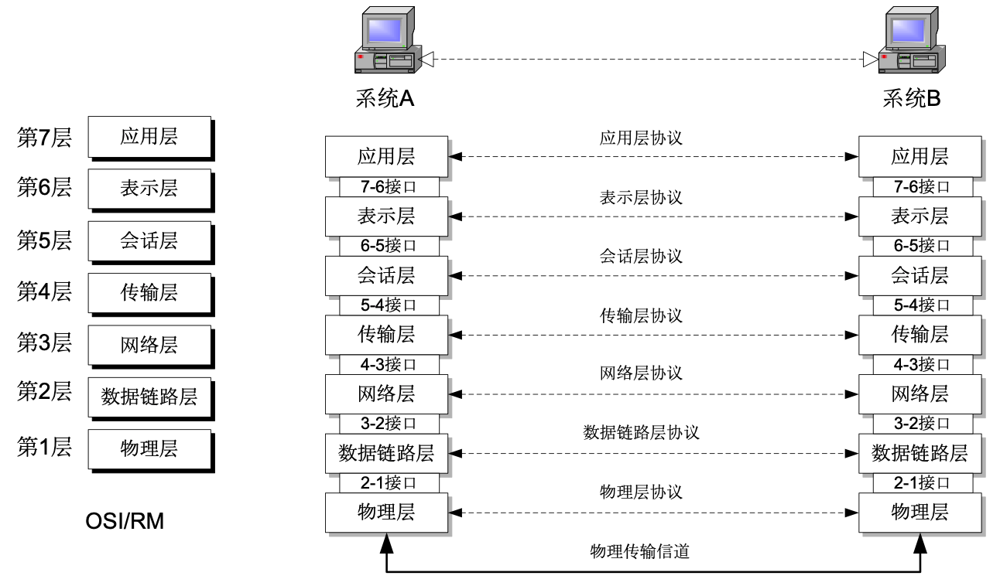
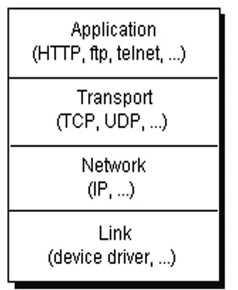
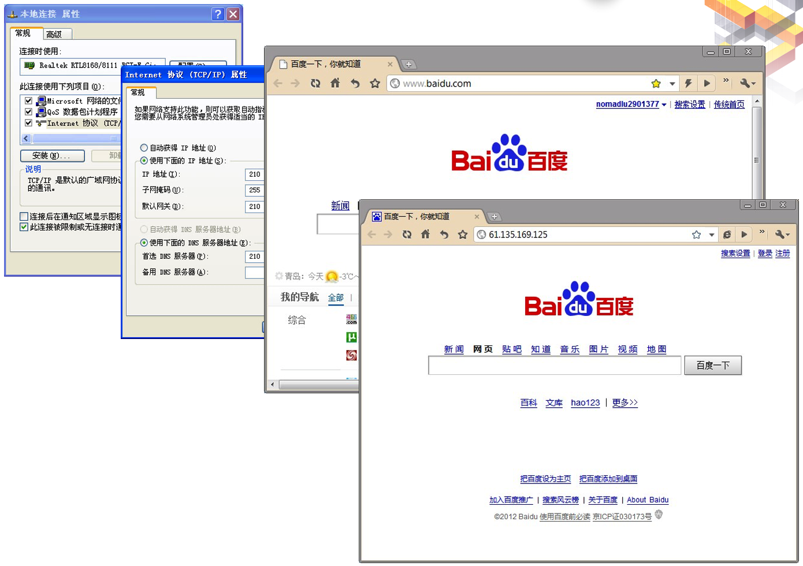
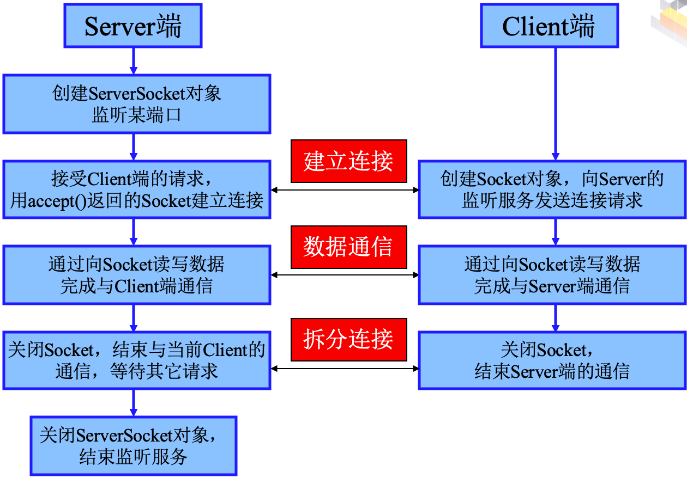
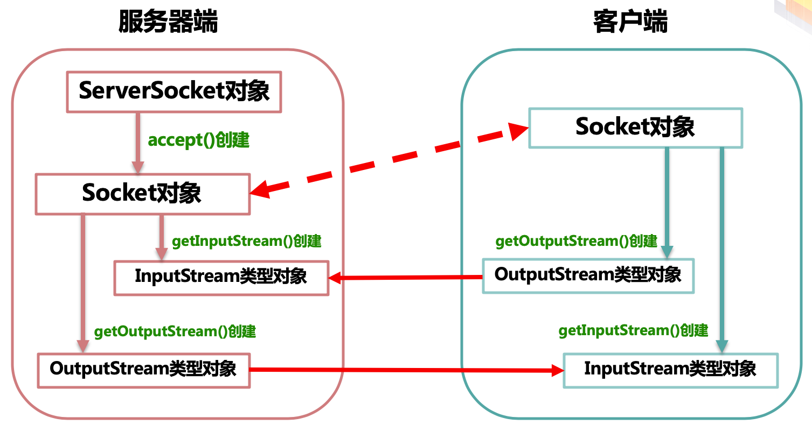

# **9. Java网络通信**

- 网络基本概念
- *java.net*包中类的使用
- 简单的*socket*程序设计

---

## *9.1 网络基础*

### <1>计算机的网络体系结构

#### [1]OSI体系结构



- 互联网上的计算机之间的通讯是通过TCP (Transport Control Protocol)   或UDP (User Datagram Protocol)协议

如下图所示



#### [2]TCP协议

- **TCP**是*Internet*的基础和核心，**一个基于连接的协议**，提供两台计算机之间的**可靠的数据流**
- 从网络通信的角度看, *Internet*是一个用**TCP/IP**协议把各个国家、各个部门、各种机构的内部网络连接起来的超级数据通信网
- 为了支持点对点通信，每个节点要有一个像电话号码一样的唯一的地址称为**IP地址**，它是一个32位的二进制数。由于不便于记忆将此地址表示成4个十进制数，各取**0-255**的值。每个值之间用点*"."*分隔
- 为了进一步方便使用，人们给每个节点都起一个名字，把名字与**IP**地址建立一个对应关系，这就是域名系统**DNS**，凡域名空间有定义的域名都可以有效地转换成IP地址

#### [3]IP地址和域名之例



#### [4]UDP协议

- 定义：UDP是从一台计算机向另一台计算机发送称为数据报的独立数据包的协议，该协议并不保证数据报是否能正确地到达目的地。它是一个非面向连接的协议
- QQ等IM软件，一般均采用UDP协议

#### [5]客户机与服务器

- *Internet*采用客户机/服务器方式访问资源，当用户在共享某个*Internet*资源时，有两个独立的程序协同服务, 这两个程序运行在不同的计算机上，通常把提供资源的计算机叫做*服务器*，把使用资源的计算机叫做*客户机*
- 由于*Internet*上用户往往不知道究竟是哪台计算机提供了资源，*客户机、服务器*指的是软件，即*客户程序和服务程序*
- 当用户使用*Internet*功能时，首先启动客户机，通过有关命令告知服务器进行连接以完成某种操作，而服务器则按照此要求提供相应的服务

#### [6]端口(PORT)

- 在互联网上传输的数据都包含有用来识别目的地的IP地址和端口号。IP地址用来标识网络上的计算机，而端口号用来指明该计算机上的应用程序
- 端口号范围为0-65535, 其中低于1024的端口号保留给那些已定义的服务,用户不能使用。如*FTP*为21，*TELNET*为23，*HTTP*为80

### <2>Java与网络

- **Java**语言取得成功的领域之一就是网络，(其他语言)数页代码-->(**Java**)一条语句
- *TCP/IP*(传输控制协议/网间协议)是*internet*的主要协议,定义了计算机和外设进行通信所使用的规则(应用层,传输层,网络层,链路层)
- 大多数基于*internet*的应用程序被看作*TCP/IP*协议的上一层. 如 : *ftp, http, smtp, pop3, telnet, nntp*等
- IP地址:*TCP/IP*网络中的每台计算机都有唯一的地址--*IP*地址
- 在**Java**中,有一个用来存储*internet*地址的类叫*InetAddress*
- **Java**提供的网络功能有三大类: *URL, Socket, Datagram*
- *URL*是三大功能中最高级的一种,通过*URL Java*程序可以直接送出或读入网络上的数据
- *Socket*是传统网络程序最常用的方式,可以想象为两个不同的程序通过网络的通信信道
- *Datagram*是更低级的网络传输方式,它把数据的目的纪录在数据包中,然后直接放在网络上

---

## *9.2 URL编程*

- 在**WWW**上，每一信息资源都有统一且唯一的地址，该地址就叫*URL(Uniform Resource Locator)*，是**WWW**的统一资源定位标识符。
- *URL*由4部分组成；资源类型、存放资源的主机域名、资源文件名和端口。例如，*<http://61.135.169.125:80/img/baidu_sylogo1.gif>*
  - http                               表示该资源类型是超文本信息
  - 61.135.169.125(www.baidu.com)      是百度的主机域名
  - 80                                  表示HTTP协议的端口号
  - /img/baidu_sylogo1.gif               表示资源文件名

> [!NOTE]
> HTTP协议默认端口号是80，FTP协议默认端口号是21

### <1>URL类及其构造方法

- 要使用*URL*进行通信，就要使用*URL*类创建其对象，通过引用*URL*类定义的方法完成网络通信
- 创建*URL*类对象要使用*java.net*包中提供的*java.net.URL*类的构造方法

URL类的构造方法|功能说明
-------------|-------
public URL(String)|使用URL字符串创建URL对象
public URL(String protocol, String host, String file)|通过指定协议名、主机名、文件名，端口使用默认值，创建URL对象
public URL(String protocol, String host, String port, String file)|通过指定协议名、主机名、文件名和端口号，创建URL对象
public URL(URL content, String str)|通过在已知的URL路径上增加细节的办法创建URL对象

### <2>URL类的方法

URL类|功能说明
-----|-------
int getPort()|获得端口号，如果端口没有设置，返回-1
String getProtocol()|获得协议名，如果协议没有设置，返回null
String getHost|获得主机名，如果主机没有设置，返回null
String getFile()|获得文件名，如果文件没有设置，返回null
Boolean equals(Object obj)|与指定的URL对象obj进行比较，如果相同返回true，否则返回false
Final InputStreamOpenString()|获得一个输出流，若获取失败，则抛出一个java.io.Exception异常
String toString()|将此URL对象转换为字符串形式

> URL程序例一

```java
//URLReader, 获取网页并按行打印
import java.net.*;
import java.io.*;

public class Network_1 {
    public static void main(String[] args) throws Exception {
        //URL数据-> InputStreamReader对象 -> BufferedReader对象  -> 程序处理
        URL hfut = new URL("http://www.baidu.com");
        BufferedReader in = new BufferedReader(new InputStreamReader( hfut.openStream()));
        String inputLine;
        //打印输出HTML
        while ((inputLine = in.readLine()) != null )
            System.out.println(inputLine);
        //关闭缓冲区
        in.close();
    }
}
```

### <3>URLConnection类

- 使用URL类可以很简单地获得信息，但如果在获取到信息的同时还能向远程的计算机节点传送信息，就需要使用URLConnection类
- 创建*URLConnection*类的对象，先创建一个*URL*对象，然后调用该对象的*openConnection()*方法就会返回一个对应*URL*地址的*URLConnection*对象。
  - //创建URL对象
    - *URL url=new URL("<http://www.baidu.com>");*
  - //创建链接通道
    - *URLConnection connect=url.openConnection();*
- 建立输入/输出流*URLConnection*类不仅可以使用*getInputStream()*方法获得URL节点的信息，还可以采用*getOutputStream()*方法向*URL*节点处传送信息
- 在建立*URLConnection*类对象的同时就已经在本级和URL节点之上建立了一条HTTP通道
- **HTTP**是一个连接协议，发送信息之前要附加确认双方身份的信息
  - *DataInputStream datain = newDataInputStream(connect.getInputStream());*

> URL程序例二

```java
//URLConnectionReader
//使用java.net.URLConnection连接到互连网，获取网页并按行打印
import java.net.*;
import java.io.*;
public class  Network_2 {
    public static void main(String[] args)  throws Exception {
        //URL对象-> URLConnection对象 -> InputStreamReader ->BufferedReader
        URL hfut = new URL("http://www.baidu.com");
        URLConnection uc = hfut.openConnection();
        BufferedReader in = new BufferedReader(new InputStreamReader(uc.getInputStream()));
        String inputLine;
        while ((inputLine = in.readLine()) != null)
            System.out.println(inputLine);
        in.close();
    }
}
```

---

## *9.3 Socket网络编程*

### <1>Socket网络编程

- *Socket*是网络上运行的程序之间双向通信链路的最后终结点
- *IP*与端口的组合得出一个套接字, 可以完全分辨*internet*上运行的程序

#### [1]Socket

- 在服务器端通过指定一个用来等待的连接的端口号创建一个*ServerSocket*实例
- 在客户端通过规定一个主机和端口号创建一个*socket*实例,连到服务器上
- *ServerSocket*类的*accept*方法使服务器处于阻塞状态,等待用户请求
- *Socket*类和*ServerSocket*是基于*TCP/IP*协议，端口必须在 0 到 65535 之间

#### [2]Socket通信过程



#### [3]简单的服务器与客户的交互

- Network_3
  - 服务器端："EchoServer"
    - ServerSocket：监听本机端口
    - Socket：连接客户端
    - PrintWriter ：向客户端输出数据
    - BufferedReader：读取客户端传入的数据
    - 客户端："EchoClient"
  - Socket: 连接服务器
    - BufferedReader：读入本地用户命令行输入
    - PrintWriter：向服务器传输数据



### <2>基于Socket的网络通信

- 当程序需要建立网络连接时，必须有一台机器运行一个程序，随时等候连接，而另一端的程序则对其发出连接请求,同电话系统类似
- 建立连接的过程
  - 服务器端生成一个*ServerSocket实例对象*，随时监听客户端的连接请求
  - 客户端生成一个*Socket*实例对象，并发出连接请求
  - 服务器端通过*accept()*方法接收到客户端的请求后，开辟一个接口与之进行连接，并生成所需的**I/O**数据流
  - 通信都是通过一对*InputStream()*和*OutputStream()*进行的，通信结束后，两端分别关闭对应的*Socket*接口

### <3>Java简单的C\S的交互

- 在**Java**中，基于**TCP**协议实现网络通信的类有两个：在客户端的*Socket*类和在服务器端的*ServerSocket*类
- *SeverSocket*类的功能是建立一个*Sever*，并通过*accept()*方法随时监听客户端的连接请求

### <4>URL与Socket的区别

- 通信方式
  - *Socket*在服务器端运行通信程序，不停地监听客户端的连接请能够使通信发求，等待客户端请求服务当客户端提出请求时，马上连接并通信；
  - *URL*进行通信时，*被动*等待客户端的请求。
- 连接数
  - *Socket*服务器可以*同时与多个客户端*进行相互通信
  - *URL*通信方式是服务器只能与一个客户端进行通信

上一篇：
> [!div class="nextstepaction"]
> [Java多线程程序设计](Java多线程程序设计.md)
