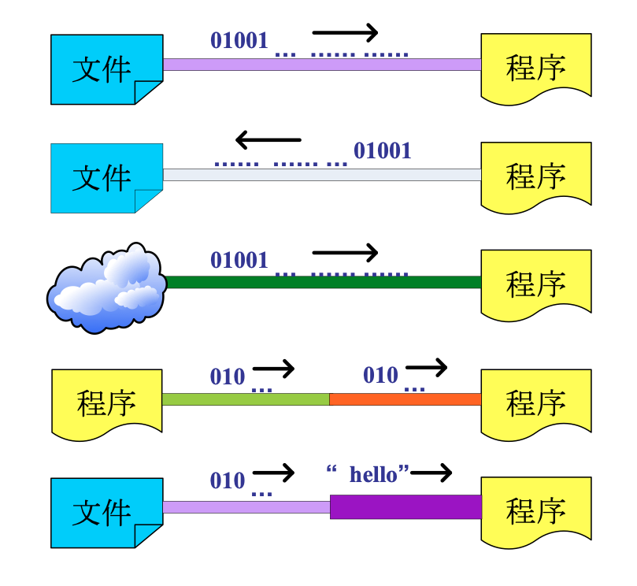
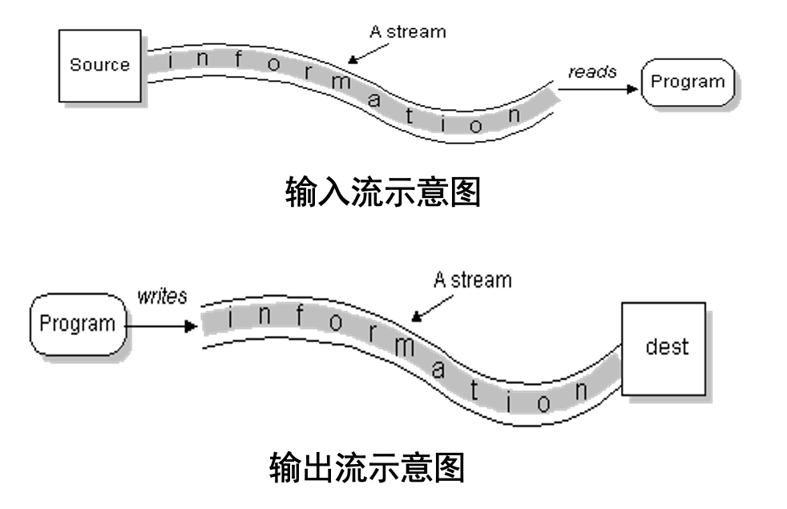

# **6. Java输入输出系统**

---

## *6.1 Java I/O 流描述*

### <1>输入输出类库

输入和输出是*程序与用户之间沟通的桥梁，是程序和用户进行信息交互的重要手段*



- **Java**的输入输出是以流（*stream*)的方式进行处理的，流是在计算机的 输入、输出操作中流动的数据序列
- **Java**按流的单位分有位流（字节流）和字符流；按流动方向分为输入流和输出流



### <2>I/O 流的分类

- 按所读写的数据类型分两类：
  - **字节流类**（*Byte Streams*） 字节流类用于向字节流读写单个字节（8 bit）。一般地，字节流类主要用于读写诸如图象或声音等的二进制数据（面向计算机）
  - **字符流类**（*Character Streams*） 字符流类用于向字符流读写一个字符（一个字符根据编码的不同，对应的字节也不同）。字符流类用来处理文本文件（面向人类）
  - **Java SDK**所提供的所有流类型位于*java.io*包内部，全部继承自以下**四种抽象流类型*

流类型|字节流|字符流
-----|------|-----
输入流|InputStream|Reader
输出流|OutputStream|Writer

---

## *6.2 文件处理*

> - 在程序中要对磁盘文件或目录进行操作，首先要对文件或目录建立连接，为此**Java**提供了*File*类
> - *File*类位于*java.io*包中，但不是流类，它不负责输入或输出，而专门用来管理磁盘文件和目录

- 类的构造方法

构造方法|描述
public File(String pathname)|根据路径名创建对象
public File(String parent, String child)| 根据父目录路径名以及字文件/目录名创建对象
public File(File parent, String child)|根据父对象以及字文件/目录名创建对象

```java
//Windows中路径分隔可使用/或\\
File file1 = new File("d:\\java\\a.txt");
File file2 = new File("d:\\java", "a.txt");
File file3 = new File(new File("d:\\"), "java\\a.txt");
```

File类的常用方法

方法名|描述
------|---
exists()|判断文件的目录是否存在，存在返回true

---

## *6.3 字节流*

---

## *6.4 字符流*

---

## *6.5 基本流*
