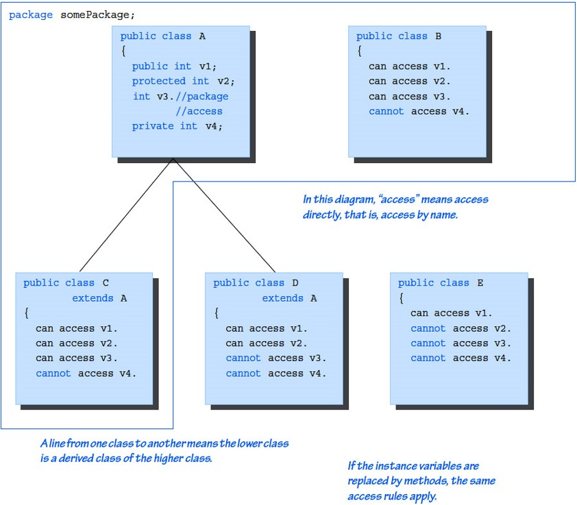
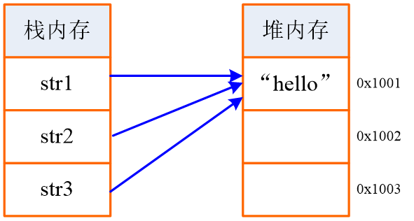
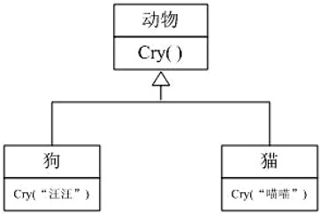
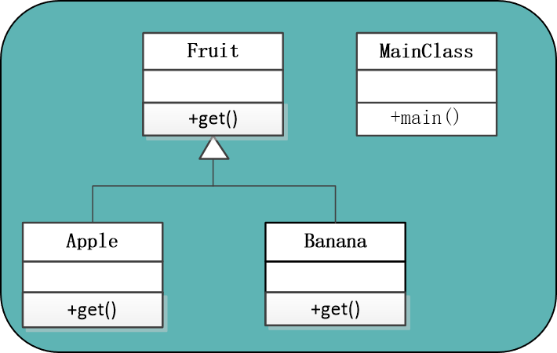

# **4. Java面向对象进阶**

[toc]

---

## *4.1 面向对象三大特性*

- 继承（Inhertiance）
- 封装（Encapsulation）
- 多态（Polymorphism）

### <1>继承性

现实世界中的对象有许多相似的特性，因此在构造类的时候就要写大量重复的代码，导致代码量大且臃肿，而且维护性不高

> - 目的：减少代码的重复，提高程序可维护性
> - 方法：将代码相同的部分提取出来组成一个父类

#### [1]类的继承

- 类之间的继承关系是现实世界中遗传关系的直接模拟，它表示类之间的内在联系以及对属性和操作的共享，即子类可以沿用父类（被继承类）的某些特征。子类也可以具有自己独立的属性和操作
- 子类从父类继承有两个主要的方面：
  - 属性的继承
  - 方法的继承

#### [2]类继承的格式

```java
[类修饰符] class 类名 [extends 父类名][implements 接口名]
{
    成员变量定义；
    方法定义；
}
```

> - 使用extends关键字完成类的继承
> - Java是一种单继承，一个子类只可以有一个父类，但一个父类可以有多个子类
> - 子类在继承的时候会完成属性的继承和方法的继承
> - 子类比它们的父类具有更多的功能。因为子类是父类的扩展，增加了父类没有的属性和方法

#### [3]构造方法的继承

1. 子类可以无条件的继承父类不含参数的构造方法
2. 如果子类没有构造方法，则它继承父类无参数的构造方法作为自己的构造方法；如果子类有构造方法，那么在创建子类对象时，则将先执行继承下来的父类的构造方法，然后再执行自己的构造方法
3. 对于父类中包含有参数的构造方法，子类可以通过在自己的构造方法中使用super关键字来引用，而且必须是子类构造方法中的第一条语句

#### [4]继承（类的初始化）

- 总是先初始化父类的成员；
- 总是先初始化static成员；
- 总是先初始化变量，后初始化方法

> 父类的*static*变量、块 -> 子类的*static*变量、块 -> 父类的实例变量 -> 父类的构造方法 -> 子类的实例变量 -> 子类的构造方法

#### [5]this关键字与super关键字

- this关键字总是指向调用该方法的对象
  - 构造器中引用该构造器正在初始化的对象
  - 在方法中引用调用该方法的对象
- this使用方式：
  - 普通直接引用
  - 形参与成员名字重名，使用this区分
  - 引用构造函数
- super关键字指向自己由父类部分生成的对象部分
- super使用方式
  - 普通直接引用，调用父类成员部分
  - 调用父类与子类同名的变量与方法
  - 引用父类构造函数

#### [6]this & super 的区别

1. 在引用父类的方法时，为了明确的是父类方法需在方法前加*super*。
2. 有时，因为继承虽然对子类的方法进行了重新定义，但是当前的方法中的形参明与成员变量名相同或与方法中的局部变量名相同，为了明确其含义，就要采用*this*关键字加以区别。
3. 下面的例子中在创建*Point3D*类对象时引用*Point2D*类的构造器，使用*super*关键字来调用父类的方法*super(a, b)*, 对于限制继承的成员变量加上*protected*说明，由于*Point*类和*Circle*类都存在*toString()*方法，所以在引用*toString()*方时用*this*和*super*加以区别

> Code - this & super

```java
class Point2D{
    int X;
    int Y;            //Point2D私有属性
    public Point2D() {    //无参的Point2D构造方法
        X = 0;
        Y = 0;
    }
    Point2D(int x, int y) {//有参的Point2D构造方法
        X = x;
        Y = y;
        //System.out.println("Point2D Constructed With Parameters!");
    }
    public String toString() {
        return ("Point position " + this.X +" " + this.Y);
    }
}
class Point3D extends Point2D {
    int X;
    int Y;
    int Z;      //Point3D私有成员属性
    public Point3D(int x, int y, int z) { //有参构造函数
        super(x, y);
        Z = z;
    }
    public String toString(){
        return (super.toString()+"  "+ this.Z);
    }
}
public class Test_Point {
    public static void main(String args[]) {
        Point3D p1, p2;
        p1 = new Point3D(1, 2, 3);
        System.out.println(p1.toString());
    }
}
```

### <2>封装性

> - **基本思想**：把客观世界中联系紧密的元素及其相关操作组织在一起，使其相互作用隐藏、封装在内部，而对外部对象只提供单一的功能接口
> - **目的**：将对象的使用者和设计者分开
> - **类比**：汽车的左转、右转（方向盘与车轮），被陶瓷封装的集成芯片

- 所谓封装表现在以下几个方面
  1. 在类的定义中设置对对象中的成员变量和方法进行访问的权限。
  2. 提供一个统一供其它类引用的方法。
  3. 其它对象不能直接修改本对象所拥有的属性和方法。
- 对象及成员变量的访问权限

#### [1]访问控制符

允许库创建者声明哪些东西是程序员可以使用的，哪些是不可使用的。这种访问控制的级别在"最大访问"和"最小访问"的范围之间

> 分别包括：public，默认(无关键字)，protected以及private

下面的列表说明访问控制修饰符含义:


#### [2]公共访问控制符public

> [!sa]
> 无论是类或者类成员，只要被声明成public，就意味着它可以被从任何地方访问

- 一个类作为整体对程序的其他部分可见，并不能代表类内的所有属性和方法也同时对程序的其他部分可见，前者只是后者的必要条件，类的属性和方法能否为所有其他类所访问，还要看这些属性和方法自己的访问控制符
- 实例变量采用*public*关键字，这是一种非常糟糕的做法,破坏封装

#### [4]

假如类或者类成员*不含有*一个明确的访问说明，说明它具有*默认的访问控制特性*。默认的访问控制权规定类或者类成员*只能被同一个包中的其他代码所访问，在包外不可见*。这种访问特性称为*包访问性*。

- Java语言中的包是类和接口的集合，它从更高级别上提供了对类和接口的存取保护和命名空间管理

#### [3]package 与 import

> 使用package关键字可以完成包的定义，放在class文件的第一行，若没有该语句，采用默认的包
>
>使用import关键字导入包，import语句位于package语句之后，所有类的定义之前，可以没有，也可以有多条

- 包创建了新的命名空间，所以不会与其他包中的命名有冲突
- 通配符"*"，可以代指该包下所有的类

```java
package pkg1[.pkg2[.pag3[...]];
import package1[.package2...].(classname|*)
```

#### [4]私有访问控制符private

- 用private修饰的类成员只能被该类中的其他成员所访问，在该类外不可见。
- 例如，在Point2D类中有两个变量，它们被定义成以下形式：

```java
    private  double  x;
    private  double  y;
```

- private（私有的）关键字用来确保可以访问这些实例变量的只能是Point2D类本身的方法。
- 在大多数实际应用的类中，有必要仅仅允许通过方法来对数据进行操作，维护封装

> Code - private

```java
//引用私有方法和修改私有成员变量
class def05_01{
    private int x,y,z = 0;
    private void method1() {
        int x = 3, y = 4, z;
        z = x * y;
        System.out.println("z = " + z);
    }
    public void show() {
        System.out.println("z = " + z);
    }
}
class ch05_01{
  public static void main(String args[]){
    def05_01 ss = new def05_01();
     ss.method1(); //调用私有方法出错
     ss.z = 12;         //修改私有变量出错
     ss.show();
   }
}
//引用公共方法和修改私有成员变量
class def05_01b {
    private int x,y,z=0;
    public void method1(){
       int x = 3, y = 4,z;
       z = x * y;
       System.out.println("z = " + z);  }
    public void show() {
       System.out.println("z = " + z);  }
 }
 class  ch05_01b {
   public static void main(String args[]){
       def05_01b ss = new def05_01b();
       ss.method1();
       ss.z = 12;
       ss.show();  }
 }
```

#### [5]保护访问控制符protected

用*protected*修饰的类成员不但对于同一个包中的其他类是可见的，而且对于其他包中该类的子类也是可见的

比较项目|private|默认|protected|public
-------|-------|---|---------|------
同一类中可见|是|是|是|是
同一个包中对子类可见|否|是|是|是
同一个包中对非子类可见|否|是|是|是
不同包中对子类可见|否|否|是|是
不同包中对非子类可见|否|否|否|是

> Code - protected方法

```java
//定义类的protected 方法，通过创建对象来引用此方法
class Max {
    private int x,y;
    protected int play(int s, int t) {
        int m;
        x = s;
        y = t;
        m = (x > y) ? x / y : y / x;
        return m;
    }
}
public class ch05_02 {
    public static void main(String args[]) {
         int result;
         Max ss = new Max();
         result = ss.play(5, 45);
         System.out.println("result = "+ result);
    }
}
```

> [!TIP]
> 使用protected定义的成员变量或方法具有二重性，类本身、子类或包中的方法可以访问它们，而其它类没有访问权限



### <3>多态性

> 由于父类和子类可以有同名的方法，在运行时JVM根据方法的调用对象的不同或者参数个数和类型的不同来查找、决定执行哪个版本的方法，称为多态性

在程序执行时，JVM对对象某一方法的查找是从该对象类所在层次开始，沿类等级逐级向上进行，把第一个方法作为所要执行的方法。所以，子类的方法可以屏蔽父类的方法

#### [1]多态机制

- 多态机制是面向对象程序设计的一个重要特征
- 多态的特点是采用同名的方式，根据调用方法时调用对象的不同、传送的参数的多少以及传送参数类型的不同，调用不同的方法，这样对于类的编制而言，可以采用同样的方法获得不同的行为特征
- 多态性
  - 编译时多态（重载）
    - 表现为方法名相同，而参数表不同
    - 典型：System.out.println(); 它的参数有很多种
  - 运行时多态（覆盖）程序运行的时候判断到底是哪个类（父类还是子类的），进而确定实际调用的方法，调用对象不同

##### (1)重载 - overload

- 所谓**方法的重载**，是在类中创建了多个方法，它们具有相同的名称，但有不同的参数和不同的实现
- 在调用方法时依据其参数个数及类型自动选择相匹配的方法去执行。达到各种对象处理类似问题时具有统一的接口目的
- 可以定义多个构造方法，根据类实例初始化时给定的参数列表决定使用哪一个

```java
java.util.Vector.remove(int index)
java.util.Vector.remove(Object o)
```

> Code - 成员方法重载

```java
//  定义多个同名方法， 实现的重载方法
//  这些方法具有相同的名称，但有不同的参数列表  
public class Test_Calculate {
    public static int abs1(int x) {     //定义整数运算的方法
        int y;
        y = x;
        if (y < 0)
            y = -y + 5;
        return y;
    }
    public static double abs1(double x)  {    //定义双精数运算的方法
        double y;
        y = x;
        if (y < 0)
            y =- y * 2;
        return y;
    }
    public static void main(String args[] )  {
        int m =- 25;
        double n =- 8.27;
        System.out.println("m = " + m + " " + abs1(m));
        System.out.println("n = " + n + " " + abs1(n));
    }
}
```

##### (2)重写（覆盖） - override

- Java 允许子类对父类的同名方法进行重新定义，因此出现了同名方法而方法的内容不同的情况。出现这种情况时，子类引用方法需要指明引用的父类的方法还是子类的方法。
- 引用父类非私有方法时采用*super*加上成员变量或方法名
  - 如: *super.成员变量* 或 *super.方法名(参数表)*
- 子类覆盖父类中方法时，不能缩小"访问范围"。
  - 如：父类中方法是*public*的，子类在覆盖时不能改为*protected*或*private*

##### (3)覆盖实现多态

- 父类的引用可以指向子类的对象，使用父类对象调用被子类覆盖的方法时，可以根据对象的不同调用不同的方法
  - 继承
  - 重写（覆盖）
  - 父类引用指向子类对象
- 例子
  - ```Parent p = new Child();```
  - 当使用多态方式调用方法时，首先检查父类中是否有该方法，如果没有，则编译错误；如果有，再去调用子类的同名方法

##### (4)多态例子

```java
public class Demo {
    public static void main(String[] args) {
      Animal a = new Cat();  
      a.eat();
      Cat c = (Cat)a;
      c.work();
    }
}
abstract class Animal {  
    abstract void eat();  
}
class Cat extends Animal {  
    public void eat() {  
        System.out.println("吃鱼");  
    }  
    public void work() {  
        System.out.println("抓老鼠");  
    }  
}
class Dog extends Animal {  
    public void eat() {  
        System.out.println("吃骨头");  
    }  
    public void work() {  
        System.out.println("看家");  
    }  
}
```

##### (5)final关键字

- *final*修饰的变量为最终成员变量
- *final*修饰的方法为最终方法

> [!div class="checklist"]
> * 最终成员变量一般是在声明时进行初始化，一旦最终成员变量被赋值，则它在整个程序执行过程中不能改变
> * 当声明常量时，可以使用final 加上类型和常量名
> * 最终方法不能被重复定义或更改方法的内容，不能被覆盖

为了防止网络黑客将属于系统的重要信息的类来创建其子类，将这些子类添加代码并替换原有的类，防止父类方法的覆盖，保持父类方法不会被子类中定义的方法替代，保证程序的安全有效的运行，可以使用final关键字，终止方法继承，保证方法不被修改

> Code - final成员变量

```java
//定义类及其方法，引用此方法时
//通过final实参对类进行初始化操作
class Calculate {
    private double r;
    final double PI=3.14159;
    void area(double r) {
       double x;
       x=PI*r*r;
       System.out.println("Area= " + x);
    }
}
public class Test_Final2 {
    public static void main(String args[]) {
       Calculate   cal = new Calculate();
       cal.area(12.3);
    }
}

```

> Code - 终止继承

```java
//   对父类中的public方法设置final 属性，禁止子类继承父类中定义的方法
//  为系统安全考虑 防止父类方法被非法覆盖
//本程序中父类定义的sum()方法具有final属性，子类不准许定义与sum同名方法
class mother {
    int x = 100, y = 20;
    public  final void sum(){
        int s;
        s = x + y;  
        System.out.println(" s="+s );
    }
}
public class Children extends mother {
    int m = 20, n = 30;
    public void sum(){
        int f;
        f = m + n;
        System.out.println("f = " + f);
    }
    public static void main(String args[]) {
        Children aa = new Children();
        aa.sum();
    }
}
```

##### (6)"比较"的方式

- 操作符 ==
  - 当操作符 == 两边都是基本数值类型变量时，比较数值是否相等
  - 当操作符 == 两边都是引用类型变量时，这两个引用变量必须都引用同一个对象，结果才为*true*
- **Object**类的*equals()*方法
  - 比较规则为：当参数*obj*引用的对象与当前对象为同一个对象，就返回*true*，否则返回*false（

```java
public boolean equals(Object obj) {
    if (this == obj)
        return true;
    else
        return false;
}
```

###### 1.eqauals()方法

- 在**JDK**中有一些类覆盖了**Object**类的**equals()**方法，它们的比较规则为：如果两个对象的类型一致，并且内容一致，则返回**true**。
- 这些类包括：**java.io.File、java.util.Date、java.lang.String、包装类(如java.lang.Integer和java.lang.Double类)**

```java
Integer int1 = new Integer(1);
Integer int2 = new Integer(1);

String str1 = new String("Hello");
String str2 = new String("Hello");

System.out.println(int1 == int2);       //打印false
System.out.println(int1.equals(int2));  //打印true

System.out.println(str1 == str2);       //打印false
System.out.println(str1.equals(str2));  //打印true
```

###### 2.String类

- 创建字符串的方式一：
  - String str1 = "hello" ; // 直接赋值
  - String str2 = "hello" ; // 直接赋值
  - String str3 = "hello" ; // 直接赋值



- 创建字符串的方式二：
  - String str1 = new String("hello") ;  // 通过new赋值
  - String str1 = new String("hello") ;  // 通过new赋值
  - String str3 = "hello" ;              // 直接赋值


###### 3.区分"＝＝"和equals()方法

```java
Float f1 = new Float("10F");
Float f2 = new Float("10F");
Double d1 = new Double("10D");
    a) f1 == f2
    b) f1.equals(f2)
    c) f2.equals(d1)
    d) f2.equals(new Float("10"))
哪些是true，哪些是false ？
```

---

## *4.2 抽象类*

### [1]什么是抽象类

> 在面向对象的概念中，所有的对象都是通过类来描绘的，但是反过来却不是这样。并不是所有的类都是用来描绘对象的，如果一个类中没有包含足够的信息来描绘一个具体的对象，这样的类就是抽象类
>
> 抽象类往往用来表征我们在对问题领域进行分析、设计中得出的抽象概念，是对一系列看上去不同，但是本质上相同的具体概念的抽象
>
> 正是因为抽象的概念在问题领域没有对应的具体概念，所以用以表征抽象概念的抽象类是不能实例化的

### [1]抽象类和方法

- 抽象类是专门设计为子类继承的类，抽象类通常都包括一个或多个抽象方法（只有方法说明，没有方法体），抽象方法体中内容，根据继承抽象类的子类的实际情况，有子类完成其抽象方法的代码。
- 定义抽象类的一般形式:

```java
abstract   class  类名称  {
    成员变量；
    方法( ){ /* do something*/ }； //定义一般方法
    abstract   方法( )；//定义抽象方法
}
```

> [!IMPORTANT]
> 注意无论抽象类和抽象方法都以关键字***abstract***开头

### [2]抽象类例1

> 
>
> 

### [3]抽象类例2

- 例程*Shape-Point-Circle-Cylinder*,有多个类分别是*Shape*类、*Point*类、*Circle*类和*Cylinder*类，他们的关系如图

> 

- 程序采取先定义一个抽象类*Shape*，通过继承关系生成*Point*类，再通过继承*Point*类生成*Circle*类，最后通过继承*Circle*类生成*Cylinder*类。
- 每一个类都是继承上一个类，而每一个类都是对它的父类的继承和扩充, 并且**实现了抽象类中定义的抽象方法**

```java
// 多继承的实现 本程序有Shape.java 、Point.java 、
// Circle.java、 Cylinder.java四个配套文件
// 多继承的实现     配套文件1
// 抽象类只给出方案，由继承它的子类去实现定义的抽象方法
public abstract class Shape {
    public double area() {
        return 0.0;
    }
    public double volume() {
        return 0.0;
    }
    public abstract String getName();
}

// 多继承的实现   配套文件 2
// 抽象类只给出模板（方案），由继承它的子类去实现定义的抽象方法
public class Point extends Shape {
    protected int x, y;            //coordinates of the Point
    public Point (int a,int b) {
        setPoint(a, b);
    }
    public void setPoint(int a, int b) {
        x = a;
        y = b;
    }
    public int getX() {
        return x;
    }
    public int getY() {
        return y;
    }
    public String getName() {
        return "Point";
    } //实现父类的抽象方法
}

// 多继承的实现   配套文件 3
// 抽象类只给出方案，由继承它的子类实现定义的抽象方法
public class Circle extends Point {
    protected double radius;
    public Circle (double r, int a, int b) { //构造函数
        super(a, b);
        setRadius(r);
    }
    public void setRadius (double r) {
        radius = (r > 0 ? r :  );
    }
    public double getRadius() {
        return radius;
    }
    public double area() {
        return Math.PI * radius * radius;
    } //覆盖
    public String getName() {
        return "Circle";
    } //实现父类的抽象方法
}

// 多继承的实现   配套文件 4
public class Cylinder extends Circle {
    protected double height;
    public Cylinder (double h, double r, int a, int b) {    //构造函数
        super(r, a, b);
        setHeight(h);
    }
    public void setHeight(double h) {    //设置高度
        height = (h > 0 ? h : 0);
    }
    public double getHeight() {
        return height;
    }    //获取高度
    public double area () {    //覆盖
        return 2 * super.area() + 2 * Math.PI * radius * height;
    }
    public double volume() {
        return super.area() * height;
    }    //覆盖
    public String getName() {
        return "Cylinder";
    } //实现父类的抽象方法
}

// 抽象类只给出方案，由继承它的子类去实现定义的抽象方法
import javax.swing.JOptionPane;
public class Show {
    public static void main(String args[]) {
        //创建Point对象并引用Point类带参数的构造方法
        String output = "";
        Point point = new Point (7, 11);
        Circle circle = new Circle (3.5, 22, 8);
        Cylinder cylinder = new Cylinder (10, 3.3, 10, 10);
        Shape arrayOfShapes[] = new Shape [3];
        arrayOfShapes[0] = point;
        arrayOfShapes[1] = circle;
        arrayOfShapes[2] = cylinder;
        for ( int i = 0; i < 3; i++)
            output = output + arrayOfShapes[i].getName() + "\n";  
        //屏幕上输出结果
        JOptionPane.showMessageDialog(null, output, "Demonstring Polymorphism", JOptionPane.INFORMATION_MESSAGE);
        System.exit(0);
    }
}

```

#### [4]其他说明

- *抽象类*里可以有*非抽象的方法*
- *抽象类*里*可以没有*抽象方法
- 即使没有抽象方法的抽象类也*不允许*实例化
- 一个类里有*abstract*方法的话，该类必须为*abstract*
- 抽象方法*一定不能有方法体*（哪怕是空方法体）

---

## *4.3 接口*

### [1]接口定义

Java中接口定义的一般形式如下

```java
[访问控制符] interface 接口名 {
		抽象方法声明
      	成员变量声明
}
```

从上面的语法规定可以看出，定义接口与定义类非常类似，实际上*可以把接口理解为一种特殊的抽象类*

> 接口体现了程序设计的多态性和高内聚低耦合的设计思想

### [2]接口定义的说明

- 接口不能被实例化
- 和类的访问级别类似，接口的访问控制符是*public*或者默认访问
- 如果接口本身被定义为*public*,所有抽象方法和成员变量都是*public*的，不论是否使用了*public*访问修饰符
- 接口中的***所有方法***都是抽象方法，在接口中只能给出这些抽象方法的方法名、返回值类型和参数列表，没有方法体（类似C++的虚类）
- 接口中可以有成员变量（但变量*不能用private和protected*修饰）
  - 接口中的变量，本质上都是*static*，而且是*final*的，无论是否用static修饰，必须以常量初始化
  - 实际开发中，常在接口中定义常用的常量，作为全局变量使用访问形式：接口名.变量名

> 一个接口不能继承其他的类，但是可以继承别的接口
>
> 一个类可以实现多个接口

### [3]接口实现

一旦接口被定义，一个或多个类可以实现该接口

> 为了实现一个接口，在类定义中使用关键字*implement*关键字，其一般形式如下

```java
[访问控制符] class 类名 [extend 父类名][implement 接口1[， 接口2...]] {
  	成员变量声明
      	方法变量声明
}
```

### [4]接口引用于实现对象的关系

- 同子类对象可以赋给父类一样，*接口引用变量可以指向实现对象*

  - 可以定义一个接口类型的引用变量，并将任何实现了该接口的类的对象赋给它。当通过接口引用变量调用方法时，将根据*动态绑定*的原则来决定方法的正确调用

  - 需要注意的是，虽然实现对象可以赋给接口引用，但该引用只能访问被它的接口定义声明的内容，而隐藏实现对象的特殊内容

> code - 多态


---

## *4.4 "设计模式"初体验 —— 简单工厂模式*
